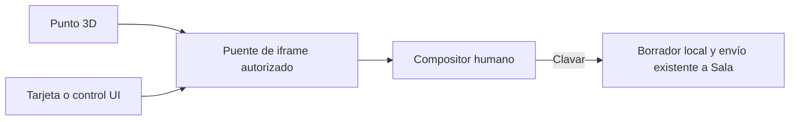

# Chinche · contexto del Despacho

Propuesta CHG-CHINCHE-CONTEXTO-DESPACHO-091, registrada antes de implementar.

La escena conserva punto de intersección, cámara, zona y versión del modelo. Las fichas existentes siguen usando v1. Las superficies de interfaz pueden usar v2 con `ui:{surface,path,item}`: superficie de una lista fija, ruta DOM acotada sin IDs de negocio, índice visible nullable. No incluir textos, valores de formularios, URLs, tokens ni identificadores privados en esa referencia.

El puente conserva comprobación del mismo origen, ventana activa y época de sesión. Abrir/cancelar no envía. Los botones de chinche no ejecutan las acciones de la tarjeta. El señalamiento global debe permitir elegir controles exactos y tarjetas añadidas después de cargar.

Alcance: Despacho virtual actual, Mi trabajo y Mi Corcho, y selección compartida en tableros envueltos por YOD OS. Los destinos externos o módulos de cliente explícitamente aislados no reciben menú/chinche sin cambiar su alcance.

Pruebas sintéticas y recursos publicados se registrarán separadamente; no acredita entrega de tareas, aprobación editorial ni modificación de permisos.

Reversión: revertir frontend por PR, sin borrar BD, fotos, registros de Sala ni datos de negocio.
