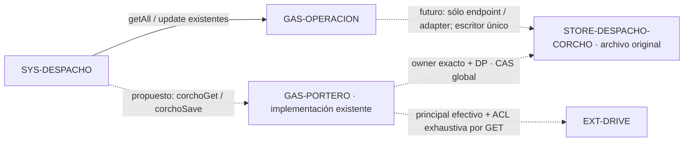

# Sala #35 · Corcho provisional en Portero existente

Propuesta `CHG-DESPACHO-CORCHO-PROVISIONAL-035`, revisión
`2026-10-03.44-corcho-provisional-035`, contrato `CTR-DESPACHO-CORCHO`.
El propietario autorizó continuar con el backend provisional existente y dejar
registro en GitHub. Este PR integra el atlas; la publicación del producto se
ejecuta y acredita en las entregas consumidoras. Sala #35 permanece abierta
hasta comprobar la persistencia autenticada y la aceptación del propietario.

## Estado y evidencia

| Pieza | Estado acreditado | Pendiente |
|---|---|---|
| Atlas base | `7843040d40e67679c3ea0b52bc09f5052d5cbbe8` | Integrar esta propuesta y fijar el SHA resultante en consumidores |
| Fuente Corcho | [board-aurum PR #4, commit 388ff869325bd9ea47ba8a2acccf00807fd85f4c](https://github.com/yodesarrollomx/board-aurum/blob/388ff869325bd9ea47ba8a2acccf00807fd85f4c/apps-script/corcho.gs) | Adapter local e integración al dispatcher Portero |
| Frontend previo | [yod-despacho PR #3, commit 32330badba66dd9b23a7413498f421aeb628c9cb](https://github.com/yodesarrollomx/yod-despacho/blob/32330badba66dd9b23a7413498f421aeb628c9cb/app.js) | PR coordinado de routing exclusivo y comprobación de su publicación |
| Mi Corcho | Archivo privado original preparado; `Corcho` y encabezados `id/version/payload_json`, vacío, sin notas de prueba | Full guard fresco en cada acceso; persistencia autenticada |
| Portero | Coordinador acredita V57, editor igual a fuente activa, principal Dirección, scopes Drive completos ya autorizados y ACL vigentes de libro y raíz owner-only | Backend Corcho publicado y fuente/versiones contrastadas por separado |
| Operación | Endpoint existente conservado; 13 proyectos comparados sin identificar el proyecto editable | Identificar editor, implementación y principal antes de migrar |

El preflight y el mapping físico se conservan en el registro privado. El atlas
usa los IDs lógicos existentes y no publica IDs físicos, correos, credenciales,
URLs completas de Apps Script ni notas. Una ACL owner-only comprobada antes de
publicar no reemplaza la comprobación del principal y ACL en cada operación.

## Conexiones propuestas y contrato conservado

| Acción de SYS-DESPACHO | Endpoint | Condición |
|---|---|---|
| `corchoGet`, `corchoSave` | URL Portero conocida actual, `GAS-PORTERO` | Únicas acciones que cambian de destino; sin fallback |
| `getAll`, `update` | URL Operación existente, `GAS-OPERACION` | Mantener comportamiento, datos y autorización existentes |
| Otras acciones existentes | Endpoint actual correspondiente | No ampliar el dispatcher ni redirigirlas a Portero |

`corchoGet` recibe POST `{action,k}` y devuelve
`{ok:true,version,data:{axes:{ejeX,ejeY},notes}}`. `corchoSave` recibe POST
`{action,k,version,data}` y devuelve la versión global nueva y el snapshot
confirmado. El transporte mantiene `text/plain` y los límites vigentes. No se
introducen otro modelo de datos, otro almacén ni versiones por nota.

Se conserva `@config` para ejes, JSON para neutralizar fórmulas, IDs y marcas
temporales, notas omitidas por el cliente, archivo/restauración sin borrado,
LockService y CAS global. Conflictos, ACK incompletos o datos inválidos conservan
el editor y no se presentan como guardado. Una respuesta incierta exige lectura
autenticada y conciliación antes de repetir una escritura.

## Adapter y configuración privados

La integración futura al `doPost` existente atiende exclusivamente
`corchoGet/corchoSave` antes del lock y guards/caches genéricos. El handler
mantiene su lock y CAS. No sustituir funciones o rutas de Portero; preservar los
cambios concurrentes del editor y la configuración vigente.

La identidad se resuelve dentro de Portero con
`canjearLigaLento_(key,'DP')`, sin HTTP a sí mismo, caché positiva ni renovación
de sesión. Exigir respuesta válida, `correo` del servidor igual al owner
configurado y DP vigente según la política existente. El rol enviado por el
cliente se ignora y un administrador de otro owner no obtiene acceso. Revocar
DP, cerrar sesión o cambiar usuario debe denegar la siguiente operación.

Mantener íntegro el full guard de Drive: obtener `about.user` con el token
efectivo, comprobar correo y `permissionId` del principal frente al propietario
único del archivo y cada ancestro hasta la raíz de Mi unidad, y recorrer
`permissions.list` paginado incluyendo permisos publicados. Rechazar permisos
ajenos, `anyone`, `domain`, unidades compartidas, herencia no comprobada,
metadatos incompletos, fallos de paginación y principal incompatible. No usar
`shared:false` como sustituto. Revalidar antes de leer, antes de escribir y al
confirmar el snapshot; fallo cerrado sin API/scopes, sin fallback ni modificación
automática de ACL o scopes.

`CORCHO_OWNER_EMAIL` y `CORCHO_SPREADSHEET_ID` mantienen el mapping privado ya
preparado. Resolver desde propiedades existentes o fallback de módulo privado
autorizado; la resolución no escribe PropertiesService ni crea/inicializa
Sheets. No añadir rutas públicas de setup/preflight, exportar el módulo privado
o incorporar su configuración al bundle frontend. Lecturas de notas nunca
aparecen en `getAll`, catálogos ni logs públicos.

## Pruebas y promoción en consumidores

1. Integrar el atlas con CI y fijar el SHA completo resultante en ambos workflows.
2. Backend: probar con dobles owner exacto/ajeno aun con admin, DP denegado o
   revocado, sesión expirada, resolución local sin renovación/caché, full guard
   de principal/ACL/ancestros/paginación/published, scopes insuficientes y fallos
   cerrados. Verificar cero escrituras de configuración o creación de recursos.
3. Probar CAS global, conflicto, concurrencia, dato inválido, conservación de
   omitidas, archivo/restauración y ACK confirmado. Conservar las regresiones de
   otras rutas de Portero. Pruebas sintéticas, sin endpoints de negocio.
4. Frontend: probar routing exacto con red interceptada para las dos acciones
   Corcho frente a `getAll/update`, rechazo, timeout, ausencia de fallback,
   conflicto, ACK inválido, cambio de sesión y móvil/escritorio.
5. En entrega de producto separada, releer editor y versión activa, respaldar
   fuente/configuración en privado, verificar principal y ACL actuales, y
   actualizar una versión de la implementación Portero existente. No crear un
   endpoint ni sustituir un editor concurrente con el snapshot V57.
6. Publicar frontend después del backend compatible; contrastar fuente servida
   y versión activa por separado. Comprobar lectura autenticada y aceptación
   autorizada del propietario, incluyendo cierre/reapertura y archivo/restauración.
   No escribir notas de prueba en el archivo real.

## Reversión y migración futura

Frontend: revertir el PR de routing a la versión anterior y repetir CI; el
baseline acreditado es `32330badba66dd9b23a7413498f421aeb628c9cb`. Si esa versión
apunta Corcho a Ops aún no preparado, mostrar rechazo/error conservando edición,
sin conmutar automáticamente ni anunciar guardado.

Backend: restaurar la versión inmediatamente anterior respaldada en **la misma
implementación y URL**. V57 es el baseline de preflight; registrar la versión
real anterior/nueva cuando se publique. Conservar el editor concurrente, la
configuración y los permisos. La reversión no borra, recrea, limpia ni restaura
Sheet, notas, ejes, IDs, versiones o ACL; conserva el historial. Un rollback del
atlas revierte únicamente este PR y sus vistas generadas.

La futura migración a Ops exige identificar su proyecto editable y contrastar
implementación, principal y permisos. Cambia **sólo endpoint/adapter** y conserva
`CTR-DESPACHO-CORCHO` y el archivo Mi Corcho original con su mapping. No copiar
filas ni introducir otro storage. Como los locks de proyectos diferentes no
serializan entre sí, detener el escritor Portero y las solicitudes en vuelo
antes de habilitar el escritor Ops; comprobar la versión global sin escrituras
de prueba. Mantener escritor único también al revertir esa migración.

## Información para manifests

Ambos consumidores deben usar `proposal_id: CHG-DESPACHO-CORCHO-PROVISIONAL-035`,
`model_revision: 2026-10-03.44-corcho-provisional-035` y
`contracts: [CTR-DESPACHO-CORCHO]`. Fijar en `.github/workflows/arquitectura.yml`
el **SHA de integración completo del atlas**, que se entrega al concluir el PR;
no usar `main`, el SHA del frontend ni el snapshot de preflight.

| Consumidor | Componentes para architecture-impact.json | Pruebas propias |
|---|---|---|
| `board-aurum` | `SYS-TAREAS`, `SYS-DESPACHO`, `GAS-OPERACION`, `GAS-PORTERO`, `STORE-DESPACHO-CORCHO`, `EXT-DRIVE` | `npm ci`, `npm run build`, `node --test tests/*.test.mjs`; regresiones sintéticas del adapter y full guard |
| `yod-despacho` | `SYS-DESPACHO`, `GAS-OPERACION`, `GAS-PORTERO`, `STORE-DESPACHO-CORCHO` | `node --check app.js`, `node --check operacion.js`, `node --check corcho.js`, `npm test`; routing exacto con red interceptada |

El manifest de cada consumidor declara sus pruebas y resultado reales y la
reversión correspondiente. CI de arquitectura acredita referencias e impacto;
no acredita por sí mismo despliegue GAS, privacidad runtime ni persistencia.
