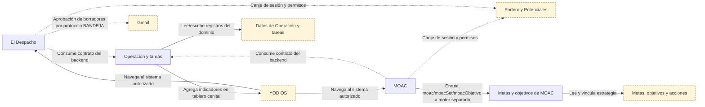
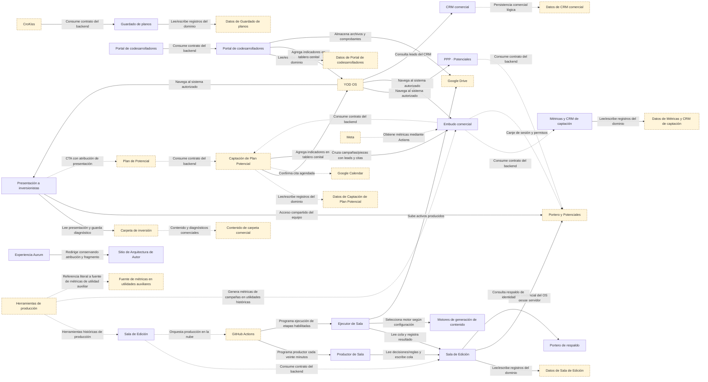
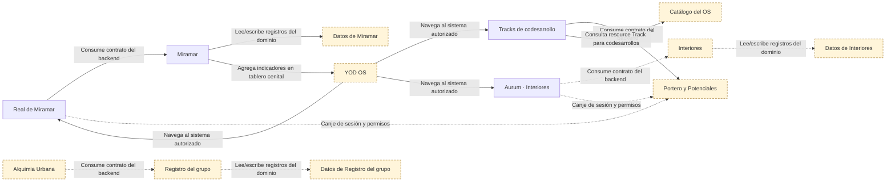
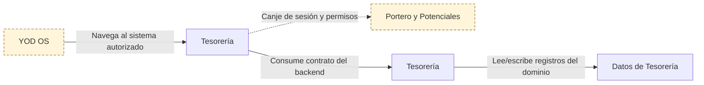
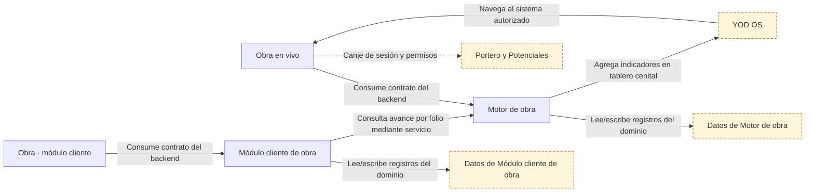
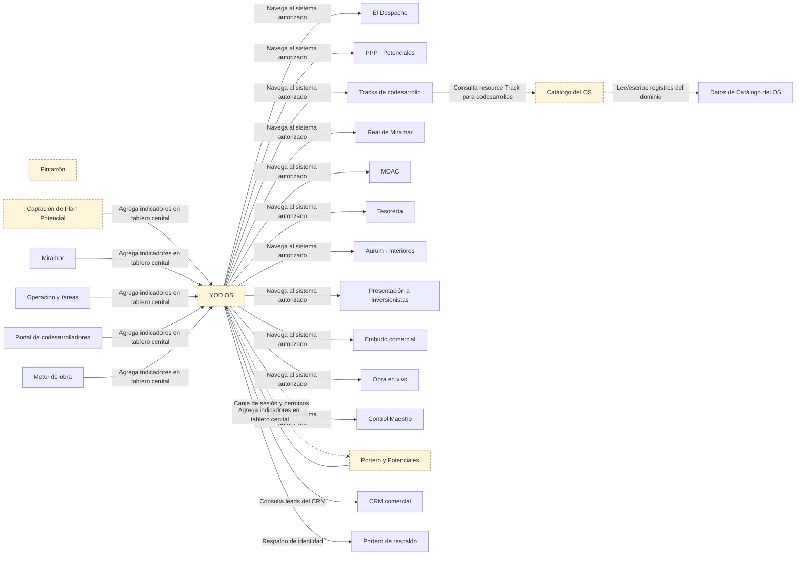
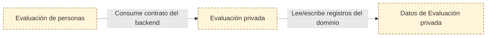
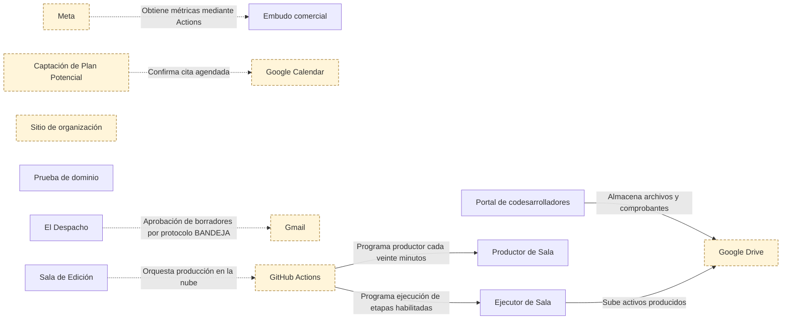
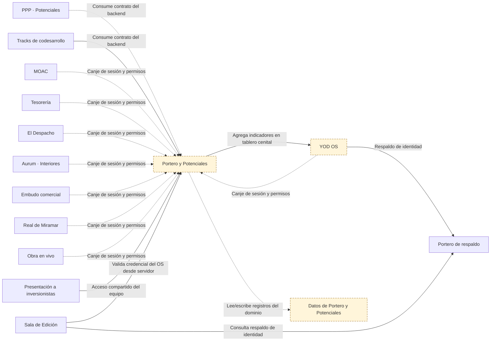

# Conexiones de YOD OS

> Generado desde modelo.json. No editar a mano. Revisión 2026-09-30.1 · 2026-09-30.

Línea continua: conexión observada en código o ejecución. Discontinua: manual, declarada, propuesta o pendiente. Una conexión observada en código no acredita el despliegue.

## Operación

## Ventas

## Proyectos

## Finanzas

## Obra

## Gobierno

## Personas

## Infraestructura

## Identidad

## Contratos y evidencia de cada conexión

| ID | Origen → destino | Mecanismo y datos | Estado | Evidencia |
|---|---|---|---|---|
| CON-001 | GAS-PORTERO → SHEET-PORTERO | persistencia: Lee/escribe registros del dominio. Ver contrato en las fuentes citadas; versión desplegada, frecuencia, errores y recuperación pendientes de verificar. | declarado | [potenciales-yod/CLAUDE.md](https://github.com/yodesarrollomx/potenciales-yod/blob/4694f7db9a3de4d5415e711d090140e6a2875f01/CLAUDE.md#L35) — Backend asociado al almacén de su dominio |
| CON-002 | GAS-CATALOGO → SHEET-CATALOGO | persistencia: Lee/escribe registros del dominio. Ver contrato en las fuentes citadas; versión desplegada, frecuencia, errores y recuperación pendientes de verificar. | declarado | [yod-portal/CLAUDE.md](https://github.com/yodesarrollomx/yod-portal/blob/82f597bee316c942e4f631a507c7f8277178fcd3/CLAUDE.md#L103) — Backend asociado al almacén de su dominio |
| CON-003 | GAS-OPERACION → SHEET-OPERACION | persistencia: Lee/escribe registros del dominio. Ver contrato en las fuentes citadas; versión desplegada, frecuencia, errores y recuperación pendientes de verificar. | codigo | [board-aurum/apps-script/portero-auth.gs](https://github.com/yodesarrollomx/board-aurum/blob/096550e5647a63048450b9be848be71901a32a3a/apps-script/portero-auth.gs#L63) — Backend asociado al almacén de su dominio |
| CON-004 | GAS-FLUJO → SHEET-FLUJO | persistencia: Lee/escribe registros del dominio. Ver contrato en las fuentes citadas; versión desplegada, frecuencia, errores y recuperación pendientes de verificar. | codigo | [board-flujo-yod/apps-script/portero-auth.gs](https://github.com/yodesarrollomx/board-flujo-yod/blob/ef2e6e1fade1b515d10af239bc60519417d906c4/apps-script/portero-auth.gs#L36) — Backend asociado al almacén de su dominio |
| CON-005 | GAS-MARKETING → SHEET-MARKETING | persistencia: Lee/escribe registros del dominio. Ver contrato en las fuentes citadas; versión desplegada, frecuencia, errores y recuperación pendientes de verificar. | codigo | [aurum-board/apps-script/portero-auth.gs](https://github.com/yodesarrollomx/aurum-board/blob/ed41c34892aa8554b9599f0f50f325bb7b1d4deb/apps-script/portero-auth.gs#L43) — Backend asociado al almacén de su dominio |
| CON-006 | GAS-PLAN-POTENCIAL → SHEET-PLAN-POTENCIAL | persistencia: Lee/escribe registros del dominio. Ver contrato en las fuentes citadas; versión desplegada, frecuencia, errores y recuperación pendientes de verificar. | declarado | [plan-potencial/CLAUDE.md](https://github.com/yodesarrollomx/plan-potencial/blob/78e616f858ad593f16891d2f5158cd46d5617bc2/CLAUDE.md#L95) — Backend asociado al almacén de su dominio |
| CON-007 | GAS-CROKISS → SHEET-CROKISS | persistencia: Lee/escribe registros del dominio. Ver contrato en las fuentes citadas; versión desplegada, frecuencia, errores y recuperación pendientes de verificar. | codigo | [crokiss/Code.gs](https://github.com/yodesarrollomx/crokiss/blob/3d440a21a6902fcefe79a124a804963613d5a31f/Code.gs#L234) — Backend asociado al almacén de su dominio |
| CON-008 | GAS-CODES → SHEET-CODES | persistencia: Lee/escribe registros del dominio. Ver contrato en las fuentes citadas; versión desplegada, frecuencia, errores y recuperación pendientes de verificar. | codigo | [Co-desarrolladores-Yod/apps_script/Código.js](https://github.com/yodesarrollomx/Co-desarrolladores-Yod/blob/f15154f784f204b60946985524e83a2539f40732/apps_script/C%C3%B3digo.js#L517) — Backend asociado al almacén de su dominio |
| CON-009 | GAS-MIRAMAR → SHEET-MIRAMAR | persistencia: Lee/escribe registros del dominio. Ver contrato en las fuentes citadas; versión desplegada, frecuencia, errores y recuperación pendientes de verificar. | codigo | [real-miramar-board/apps-script/portero-auth.gs](https://github.com/yodesarrollomx/real-miramar-board/blob/a46e513548ceb188fb631bd123ef9f682eff95bf/apps-script/portero-auth.gs#L48) — Backend asociado al almacén de su dominio |
| CON-010 | GAS-INTERIORES → SHEET-INTERIORES | persistencia: Lee/escribe registros del dominio. Ver contrato en las fuentes citadas; versión desplegada, frecuencia, errores y recuperación pendientes de verificar. | declarado | [interiores-aurum/CLAUDE.md](https://github.com/yodesarrollomx/interiores-aurum/blob/6722c50b504c2f326d29d187605b2ad126e7ce17/CLAUDE.md#L33) — Backend asociado al almacén de su dominio |
| CON-011 | GAS-ALQUIMIA → SHEET-ALQUIMIA | persistencia: Lee/escribe registros del dominio. Ver contrato en las fuentes citadas; versión desplegada, frecuencia, errores y recuperación pendientes de verificar. | declarado | [alquimia-urbana/CLAUDE.md](https://github.com/yodesarrollomx/alquimia-urbana/blob/bf295e2970ad008e58fa3f216a8cfc14353cf7e8/CLAUDE.md#L63) — Backend asociado al almacén de su dominio |
| CON-012 | GAS-OBRA → SHEET-OBRA | persistencia: Lee/escribe registros del dominio. Ver contrato en las fuentes citadas; versión desplegada, frecuencia, errores y recuperación pendientes de verificar. | codigo | [yod-portal/obra.html](https://github.com/yodesarrollomx/yod-portal/blob/82f597bee316c942e4f631a507c7f8277178fcd3/obra.html#L259) — Backend asociado al almacén de su dominio |
| CON-013 | GAS-OBRA-CLIENTE → SHEET-OBRA-CLIENTE | persistencia: Lee/escribe registros del dominio. Ver contrato en las fuentes citadas; versión desplegada, frecuencia, errores y recuperación pendientes de verificar. | codigo | [yod-portal/obra-app/motor/ObraCliente.gs](https://github.com/yodesarrollomx/yod-portal/blob/82f597bee316c942e4f631a507c7f8277178fcd3/obra-app/motor/ObraCliente.gs#L175) — Backend asociado al almacén de su dominio |
| CON-014 | GAS-SALA → SHEET-SALA | persistencia: Lee/escribe registros del dominio. Ver contrato en las fuentes citadas; versión desplegada, frecuencia, errores y recuperación pendientes de verificar. | codigo | [sala-edicion/gas/Code.gs](https://github.com/yodesarrollomx/sala-edicion/blob/dd62430eda613b73b703a3b9052214cbdd432ea7/gas/Code.gs#L713) — Backend asociado al almacén de su dominio |
| CON-015 | GAS-EMD → SHEET-EMD | persistencia: Lee/escribe registros del dominio. Ver contrato en las fuentes citadas; versión desplegada, frecuencia, errores y recuperación pendientes de verificar. | pendiente | Integración pendiente de verificar |
| CON-016 | SYS-DESPACHO → GAS-OPERACION | api: Consume contrato del backend. Ver contrato en las fuentes citadas; versión desplegada, frecuencia, errores y recuperación pendientes de verificar. | declarado | [yod-despacho/README.md](https://github.com/yodesarrollomx/yod-despacho/blob/5ad406a6b8584ee49466b15e03a9a3bf8a9ca4b9/README.md#L13) — Conexión cliente/backend |
| CON-017 | SYS-TAREAS → GAS-OPERACION | api: Consume contrato del backend. Ver contrato en las fuentes citadas; versión desplegada, frecuencia, errores y recuperación pendientes de verificar. | declarado | [board-aurum/README.md](https://github.com/yodesarrollomx/board-aurum/blob/096550e5647a63048450b9be848be71901a32a3a/README.md#L11) — Conexión cliente/backend |
| CON-018 | SYS-FLUJO → GAS-FLUJO | api: Consume contrato del backend. Ver contrato en las fuentes citadas; versión desplegada, frecuencia, errores y recuperación pendientes de verificar. | codigo | [board-flujo-yod/index.html](https://github.com/yodesarrollomx/board-flujo-yod/blob/ef2e6e1fade1b515d10af239bc60519417d906c4/index.html#L379) — Conexión cliente/backend |
| CON-019 | SYS-POTENCIALES → GAS-PORTERO | api: Consume contrato del backend. Ver contrato en las fuentes citadas; versión desplegada, frecuencia, errores y recuperación pendientes de verificar. | declarado | [potenciales-yod/CLAUDE.md](https://github.com/yodesarrollomx/potenciales-yod/blob/4694f7db9a3de4d5415e711d090140e6a2875f01/CLAUDE.md#L47) — Conexión cliente/backend |
| CON-020 | SYS-TRACK → GAS-PORTERO | api: Consume contrato del backend. Ver contrato en las fuentes citadas; versión desplegada, frecuencia, errores y recuperación pendientes de verificar. | codigo | [yod-portal/tablero.html](https://github.com/yodesarrollomx/yod-portal/blob/82f597bee316c942e4f631a507c7f8277178fcd3/tablero.html#L1683) — Conexión cliente/backend |
| CON-021 | SYS-MARKETING → GAS-MARKETING | api: Consume contrato del backend. Ver contrato en las fuentes citadas; versión desplegada, frecuencia, errores y recuperación pendientes de verificar. | declarado | [aurum-board/CLAUDE.md](https://github.com/yodesarrollomx/aurum-board/blob/ed41c34892aa8554b9599f0f50f325bb7b1d4deb/CLAUDE.md#L95) — Conexión cliente/backend |
| CON-022 | SYS-MARKETING → GAS-PLAN-POTENCIAL | api: Consume contrato del backend. Ver contrato en las fuentes citadas; versión desplegada, frecuencia, errores y recuperación pendientes de verificar. | declarado | [aurum-board/CLAUDE.md](https://github.com/yodesarrollomx/aurum-board/blob/ed41c34892aa8554b9599f0f50f325bb7b1d4deb/CLAUDE.md#L99) — Conexión cliente/backend |
| CON-023 | SYS-PLAN-POTENCIAL → GAS-PLAN-POTENCIAL | api: Consume contrato del backend. Ver contrato en las fuentes citadas; versión desplegada, frecuencia, errores y recuperación pendientes de verificar. | declarado | [plan-potencial/CLAUDE.md](https://github.com/yodesarrollomx/plan-potencial/blob/78e616f858ad593f16891d2f5158cd46d5617bc2/CLAUDE.md#L131) — Conexión cliente/backend |
| CON-024 | SYS-CROKISS → GAS-CROKISS | api: Consume contrato del backend. Ver contrato en las fuentes citadas; versión desplegada, frecuencia, errores y recuperación pendientes de verificar. | codigo | [crokiss/Code.gs](https://github.com/yodesarrollomx/crokiss/blob/3d440a21a6902fcefe79a124a804963613d5a31f/Code.gs#L234) — Conexión cliente/backend |
| CON-025 | SYS-CODES-PORTAL → GAS-CODES | api: Consume contrato del backend. Ver contrato en las fuentes citadas; versión desplegada, frecuencia, errores y recuperación pendientes de verificar. | codigo | [Co-desarrolladores-Yod/src/App.jsx](https://github.com/yodesarrollomx/Co-desarrolladores-Yod/blob/f15154f784f204b60946985524e83a2539f40732/src/App.jsx#L775) — Conexión cliente/backend |
| CON-026 | SYS-MIRAMAR → GAS-MIRAMAR | api: Consume contrato del backend. Ver contrato en las fuentes citadas; versión desplegada, frecuencia, errores y recuperación pendientes de verificar. | codigo | [real-miramar-board/assets/board.js](https://github.com/yodesarrollomx/real-miramar-board/blob/a46e513548ceb188fb631bd123ef9f682eff95bf/assets/board.js#L34) — Conexión cliente/backend |
| CON-027 | SYS-INTERIORES → GAS-INTERIORES | api: Consume contrato del backend. Ver contrato en las fuentes citadas; versión desplegada, frecuencia, errores y recuperación pendientes de verificar. | declarado | [interiores-aurum/CLAUDE.md](https://github.com/yodesarrollomx/interiores-aurum/blob/6722c50b504c2f326d29d187605b2ad126e7ce17/CLAUDE.md#L51) — Conexión cliente/backend |
| CON-028 | SYS-ALQUIMIA → GAS-ALQUIMIA | api: Consume contrato del backend. Ver contrato en las fuentes citadas; versión desplegada, frecuencia, errores y recuperación pendientes de verificar. | declarado | [alquimia-urbana/CLAUDE.md](https://github.com/yodesarrollomx/alquimia-urbana/blob/bf295e2970ad008e58fa3f216a8cfc14353cf7e8/CLAUDE.md#L48) — Conexión cliente/backend |
| CON-029 | SYS-OBRA → GAS-OBRA | api: Consume contrato del backend. Ver contrato en las fuentes citadas; versión desplegada, frecuencia, errores y recuperación pendientes de verificar. | codigo | [yod-portal/obra.html](https://github.com/yodesarrollomx/yod-portal/blob/82f597bee316c942e4f631a507c7f8277178fcd3/obra.html#L259) — Conexión cliente/backend |
| CON-030 | SYS-OBRA-CLIENTE → GAS-OBRA-CLIENTE | api: Consume contrato del backend. Ver contrato en las fuentes citadas; versión desplegada, frecuencia, errores y recuperación pendientes de verificar. | codigo | [yod-portal/obra-app/obras.js](https://github.com/yodesarrollomx/yod-portal/blob/82f597bee316c942e4f631a507c7f8277178fcd3/obra-app/obras.js#L13) — Conexión cliente/backend |
| CON-031 | SYS-SALA → GAS-SALA | api: Consume contrato del backend. Ver contrato en las fuentes citadas; versión desplegada, frecuencia, errores y recuperación pendientes de verificar. | declarado | [sala-edicion/CLAUDE.md](https://github.com/yodesarrollomx/sala-edicion/blob/dd62430eda613b73b703a3b9052214cbdd432ea7/CLAUDE.md#L24) — Conexión cliente/backend |
| CON-032 | SYS-EMD → GAS-EMD | api: Consume contrato del backend. Ver contrato en las fuentes citadas; versión desplegada, frecuencia, errores y recuperación pendientes de verificar. | pendiente | Integración pendiente de verificar |
| CON-033 | SYS-YOD-OS → SYS-DESPACHO | navegacion: Navega al sistema autorizado. Ver contrato en las fuentes citadas; versión desplegada, frecuencia, errores y recuperación pendientes de verificar. | codigo | [yod-portal/os/catalogo.js](https://github.com/yodesarrollomx/yod-portal/blob/82f597bee316c942e4f631a507c7f8277178fcd3/os/catalogo.js#L16) — Destino del catálogo |
| CON-034 | SYS-YOD-OS → SYS-POTENCIALES | navegacion: Navega al sistema autorizado. Ver contrato en las fuentes citadas; versión desplegada, frecuencia, errores y recuperación pendientes de verificar. | codigo | [yod-portal/os/catalogo.js](https://github.com/yodesarrollomx/yod-portal/blob/82f597bee316c942e4f631a507c7f8277178fcd3/os/catalogo.js#L17) — Destino del catálogo |
| CON-035 | SYS-YOD-OS → SYS-TRACK | navegacion: Navega al sistema autorizado. Ver contrato en las fuentes citadas; versión desplegada, frecuencia, errores y recuperación pendientes de verificar. | codigo | [yod-portal/os/catalogo.js](https://github.com/yodesarrollomx/yod-portal/blob/82f597bee316c942e4f631a507c7f8277178fcd3/os/catalogo.js#L18) — Destino del catálogo |
| CON-036 | SYS-YOD-OS → SYS-MIRAMAR | navegacion: Navega al sistema autorizado. Ver contrato en las fuentes citadas; versión desplegada, frecuencia, errores y recuperación pendientes de verificar. | codigo | [yod-portal/os/catalogo.js](https://github.com/yodesarrollomx/yod-portal/blob/82f597bee316c942e4f631a507c7f8277178fcd3/os/catalogo.js#L19) — Destino del catálogo |
| CON-037 | SYS-YOD-OS → SYS-TAREAS | navegacion: Navega al sistema autorizado. Ver contrato en las fuentes citadas; versión desplegada, frecuencia, errores y recuperación pendientes de verificar. | codigo | [yod-portal/os/catalogo.js](https://github.com/yodesarrollomx/yod-portal/blob/82f597bee316c942e4f631a507c7f8277178fcd3/os/catalogo.js#L20) — Destino del catálogo |
| CON-038 | SYS-YOD-OS → SYS-FLUJO | navegacion: Navega al sistema autorizado. Ver contrato en las fuentes citadas; versión desplegada, frecuencia, errores y recuperación pendientes de verificar. | codigo | [yod-portal/os/catalogo.js](https://github.com/yodesarrollomx/yod-portal/blob/82f597bee316c942e4f631a507c7f8277178fcd3/os/catalogo.js#L21) — Destino del catálogo |
| CON-039 | SYS-YOD-OS → SYS-INTERIORES | navegacion: Navega al sistema autorizado. Ver contrato en las fuentes citadas; versión desplegada, frecuencia, errores y recuperación pendientes de verificar. | codigo | [yod-portal/os/catalogo.js](https://github.com/yodesarrollomx/yod-portal/blob/82f597bee316c942e4f631a507c7f8277178fcd3/os/catalogo.js#L22) — Destino del catálogo |
| CON-040 | SYS-YOD-OS → SYS-INVERSION | navegacion: Navega al sistema autorizado. Ver contrato en las fuentes citadas; versión desplegada, frecuencia, errores y recuperación pendientes de verificar. | codigo | [yod-portal/os/catalogo.js](https://github.com/yodesarrollomx/yod-portal/blob/82f597bee316c942e4f631a507c7f8277178fcd3/os/catalogo.js#L23) — Destino del catálogo |
| CON-041 | SYS-YOD-OS → SYS-MARKETING | navegacion: Navega al sistema autorizado. Ver contrato en las fuentes citadas; versión desplegada, frecuencia, errores y recuperación pendientes de verificar. | codigo | [yod-portal/os/catalogo.js](https://github.com/yodesarrollomx/yod-portal/blob/82f597bee316c942e4f631a507c7f8277178fcd3/os/catalogo.js#L24) — Destino del catálogo |
| CON-042 | SYS-YOD-OS → SYS-OBRA | navegacion: Navega al sistema autorizado. Ver contrato en las fuentes citadas; versión desplegada, frecuencia, errores y recuperación pendientes de verificar. | codigo | [yod-portal/os/catalogo.js](https://github.com/yodesarrollomx/yod-portal/blob/82f597bee316c942e4f631a507c7f8277178fcd3/os/catalogo.js#L25) — Destino del catálogo |
| CON-043 | SYS-YOD-OS → SYS-CONTROL | navegacion: Navega al sistema autorizado. Ver contrato en las fuentes citadas; versión desplegada, frecuencia, errores y recuperación pendientes de verificar. | codigo | [yod-portal/os/catalogo.js](https://github.com/yodesarrollomx/yod-portal/blob/82f597bee316c942e4f631a507c7f8277178fcd3/os/catalogo.js#L26) — Destino del catálogo |
| CON-044 | SYS-YOD-OS → GAS-PORTERO | autenticacion: Canje de sesión y permisos. Ver contrato en las fuentes citadas; versión desplegada, frecuencia, errores y recuperación pendientes de verificar. | declarado | [yod-portal/CLAUDE.md](https://github.com/yodesarrollomx/yod-portal/blob/82f597bee316c942e4f631a507c7f8277178fcd3/CLAUDE.md#L48) — Cada backend valida su acceso |
| CON-045 | SYS-TAREAS → GAS-PORTERO | autenticacion: Canje de sesión y permisos. Ver contrato en las fuentes citadas; versión desplegada, frecuencia, errores y recuperación pendientes de verificar. | declarado | [yod-portal/CLAUDE.md](https://github.com/yodesarrollomx/yod-portal/blob/82f597bee316c942e4f631a507c7f8277178fcd3/CLAUDE.md#L48) — Cada backend valida su acceso |
| CON-046 | SYS-FLUJO → GAS-PORTERO | autenticacion: Canje de sesión y permisos. Ver contrato en las fuentes citadas; versión desplegada, frecuencia, errores y recuperación pendientes de verificar. | declarado | [yod-portal/CLAUDE.md](https://github.com/yodesarrollomx/yod-portal/blob/82f597bee316c942e4f631a507c7f8277178fcd3/CLAUDE.md#L48) — Cada backend valida su acceso |
| CON-047 | SYS-DESPACHO → GAS-PORTERO | autenticacion: Canje de sesión y permisos. Ver contrato en las fuentes citadas; versión desplegada, frecuencia, errores y recuperación pendientes de verificar. | declarado | [yod-portal/CLAUDE.md](https://github.com/yodesarrollomx/yod-portal/blob/82f597bee316c942e4f631a507c7f8277178fcd3/CLAUDE.md#L48) — Cada backend valida su acceso |
| CON-048 | SYS-INTERIORES → GAS-PORTERO | autenticacion: Canje de sesión y permisos. Ver contrato en las fuentes citadas; versión desplegada, frecuencia, errores y recuperación pendientes de verificar. | declarado | [yod-portal/CLAUDE.md](https://github.com/yodesarrollomx/yod-portal/blob/82f597bee316c942e4f631a507c7f8277178fcd3/CLAUDE.md#L48) — Cada backend valida su acceso |
| CON-049 | SYS-MARKETING → GAS-PORTERO | autenticacion: Canje de sesión y permisos. Ver contrato en las fuentes citadas; versión desplegada, frecuencia, errores y recuperación pendientes de verificar. | declarado | [yod-portal/CLAUDE.md](https://github.com/yodesarrollomx/yod-portal/blob/82f597bee316c942e4f631a507c7f8277178fcd3/CLAUDE.md#L48) — Cada backend valida su acceso |
| CON-050 | SYS-MIRAMAR → GAS-PORTERO | autenticacion: Canje de sesión y permisos. Ver contrato en las fuentes citadas; versión desplegada, frecuencia, errores y recuperación pendientes de verificar. | declarado | [yod-portal/CLAUDE.md](https://github.com/yodesarrollomx/yod-portal/blob/82f597bee316c942e4f631a507c7f8277178fcd3/CLAUDE.md#L48) — Cada backend valida su acceso |
| CON-051 | SYS-OBRA → GAS-PORTERO | autenticacion: Canje de sesión y permisos. Ver contrato en las fuentes citadas; versión desplegada, frecuencia, errores y recuperación pendientes de verificar. | declarado | [yod-portal/CLAUDE.md](https://github.com/yodesarrollomx/yod-portal/blob/82f597bee316c942e4f631a507c7f8277178fcd3/CLAUDE.md#L48) — Cada backend valida su acceso |
| CON-052 | GAS-PLAN-POTENCIAL → SYS-YOD-OS | lectura_agregada: Agrega indicadores en tablero cenital. Ver contrato en las fuentes citadas; versión desplegada, frecuencia, errores y recuperación pendientes de verificar. | codigo | [yod-portal/tablero.html](https://github.com/yodesarrollomx/yod-portal/blob/82f597bee316c942e4f631a507c7f8277178fcd3/tablero.html#L1505) — Conector de resumen |
| CON-053 | GAS-MIRAMAR → SYS-YOD-OS | lectura_agregada: Agrega indicadores en tablero cenital. Ver contrato en las fuentes citadas; versión desplegada, frecuencia, errores y recuperación pendientes de verificar. | codigo | [yod-portal/tablero.html](https://github.com/yodesarrollomx/yod-portal/blob/82f597bee316c942e4f631a507c7f8277178fcd3/tablero.html#L1543) — Conector de resumen |
| CON-054 | GAS-PORTERO → SYS-YOD-OS | lectura_agregada: Agrega indicadores en tablero cenital. Ver contrato en las fuentes citadas; versión desplegada, frecuencia, errores y recuperación pendientes de verificar. | codigo | [yod-portal/tablero.html](https://github.com/yodesarrollomx/yod-portal/blob/82f597bee316c942e4f631a507c7f8277178fcd3/tablero.html#L1683) — Conector de resumen |
| CON-055 | GAS-OPERACION → SYS-YOD-OS | lectura_agregada: Agrega indicadores en tablero cenital. Ver contrato en las fuentes citadas; versión desplegada, frecuencia, errores y recuperación pendientes de verificar. | codigo | [yod-portal/tablero.html](https://github.com/yodesarrollomx/yod-portal/blob/82f597bee316c942e4f631a507c7f8277178fcd3/tablero.html#L1717) — Conector de resumen |
| CON-056 | GAS-CODES → SYS-YOD-OS | lectura_agregada: Agrega indicadores en tablero cenital. Ver contrato en las fuentes citadas; versión desplegada, frecuencia, errores y recuperación pendientes de verificar. | codigo | [yod-portal/tablero.html](https://github.com/yodesarrollomx/yod-portal/blob/82f597bee316c942e4f631a507c7f8277178fcd3/tablero.html#L1755) — Conector de resumen |
| CON-057 | GAS-OBRA → SYS-YOD-OS | lectura_agregada: Agrega indicadores en tablero cenital. Ver contrato en las fuentes citadas; versión desplegada, frecuencia, errores y recuperación pendientes de verificar. | codigo | [yod-portal/tablero.html](https://github.com/yodesarrollomx/yod-portal/blob/82f597bee316c942e4f631a507c7f8277178fcd3/tablero.html#L1605) — Conector de resumen |
| CON-058 | GAS-OBRA-CLIENTE → GAS-OBRA | lectura: Consulta avance por folio mediante servicio. Ver contrato en las fuentes citadas; versión desplegada, frecuencia, errores y recuperación pendientes de verificar. | codigo | [yod-portal/obra-app/motor/ObraCliente.gs](https://github.com/yodesarrollomx/yod-portal/blob/82f597bee316c942e4f631a507c7f8277178fcd3/obra-app/motor/ObraCliente.gs#L107) — Lectura del motor de obra |
| CON-059 | GAS-PLAN-POTENCIAL → EXT-CALENDAR | integracion: Confirma cita agendada. Ver contrato en las fuentes citadas; versión desplegada, frecuencia, errores y recuperación pendientes de verificar. | declarado | [plan-potencial/CLAUDE.md](https://github.com/yodesarrollomx/plan-potencial/blob/78e616f858ad593f16891d2f5158cd46d5617bc2/CLAUDE.md#L101) — Cruce declarado con Calendar |
| CON-060 | EXT-META → SYS-MARKETING | integracion: Obtiene métricas mediante Actions. Ver contrato en las fuentes citadas; versión desplegada, frecuencia, errores y recuperación pendientes de verificar. | declarado | [aurum-board/CLAUDE.md](https://github.com/yodesarrollomx/aurum-board/blob/ed41c34892aa8554b9599f0f50f325bb7b1d4deb/CLAUDE.md#L30) — Generación periódica de métricas |
| CON-061 | SYS-DESPACHO → EXT-GMAIL | accion_humana_y_rutina: Aprobación de borradores por protocolo BANDEJA. Ver contrato en las fuentes citadas; versión desplegada, frecuencia, errores y recuperación pendientes de verificar. | declarado | [yod-despacho/EJECUTOR.md](https://github.com/yodesarrollomx/yod-despacho/blob/5ad406a6b8584ee49466b15e03a9a3bf8a9ca4b9/EJECUTOR.md#L14) — Rutina externa declarada con aprobación humana |
| CON-062 | GAS-CODES → EXT-DRIVE | documentos: Almacena archivos y comprobantes. Ver contrato en las fuentes citadas; versión desplegada, frecuencia, errores y recuperación pendientes de verificar. | codigo | [Co-desarrolladores-Yod/apps_script/Código.js](https://github.com/yodesarrollomx/Co-desarrolladores-Yod/blob/f15154f784f204b60946985524e83a2539f40732/apps_script/C%C3%B3digo.js#L1139) — Subida de archivos de portal |
| CON-063 | SYS-SALA → EXT-ACTIONS | automatizacion: Orquesta producción en la nube. Ver contrato en las fuentes citadas; versión desplegada, frecuencia, errores y recuperación pendientes de verificar. | declarado | [sala-edicion/CLAUDE.md](https://github.com/yodesarrollomx/sala-edicion/blob/dd62430eda613b73b703a3b9052214cbdd432ea7/CLAUDE.md#L85) — Ciclo de producción en nube |
| CON-064 | SYS-SALA-OPERACION → SYS-SALA | automatizacion: Herramientas históricas de producción. Ver contrato en las fuentes citadas; versión desplegada, frecuencia, errores y recuperación pendientes de verificar. | declarado | [sala-edicion/CLAUDE.md](https://github.com/yodesarrollomx/sala-edicion/blob/dd62430eda613b73b703a3b9052214cbdd432ea7/CLAUDE.md#L69) — Migración de herramientas a nube |
| CON-065 | SYS-YOD-OS → GAS-CRM | lectura_agregada: Consulta leads del CRM. Ver contrato en las fuentes citadas; versión desplegada, frecuencia, errores y recuperación pendientes de verificar. | codigo | [yod-portal/tablero.html](https://github.com/yodesarrollomx/yod-portal/blob/82f597bee316c942e4f631a507c7f8277178fcd3/tablero.html#L1800) — Conector de CRM |
| CON-066 | GAS-CRM → SHEET-CRM | persistencia: Persistencia comercial lógica. Ver contrato en las fuentes citadas; versión desplegada, frecuencia, errores y recuperación pendientes de verificar. | pendiente | Integración pendiente de verificar |
| CON-067 | SYS-TAREAS → GAS-MOAC-METAS | api: Enruta moac/moacSet/moacObjetivo a motor separado. Ver contrato en las fuentes citadas; versión desplegada, frecuencia, errores y recuperación pendientes de verificar. | codigo | [board-aurum/src/App.jsx](https://github.com/yodesarrollomx/board-aurum/blob/096550e5647a63048450b9be848be71901a32a3a/src/App.jsx#L468) — Selección de motor por prefijo |
| CON-068 | GAS-MOAC-METAS → SHEET-MOAC-METAS | persistencia: Lee y vincula estrategia. Ver contrato en las fuentes citadas; versión desplegada, frecuencia, errores y recuperación pendientes de verificar. | codigo | [board-aurum/src/App.jsx](https://github.com/yodesarrollomx/board-aurum/blob/096550e5647a63048450b9be848be71901a32a3a/src/App.jsx#L1957) — Libro fuente declarado en código |
| CON-069 | SYS-INVERSION → GAS-INVERSION | api: Lee presentación y guarda diagnóstico. Ver contrato en las fuentes citadas; versión desplegada, frecuencia, errores y recuperación pendientes de verificar. | codigo | [yodesarrollo-board/data-loader.jsx](https://github.com/yodesarrollomx/yodesarrollo-board/blob/4774888ede9caf53684ed7509d36ef7ffe1e126e/data-loader.jsx#L360) — Capa de datos de presentación; [yodesarrollo-board/CLAUDE.md](https://github.com/yodesarrollomx/yodesarrollo-board/blob/4774888ede9caf53684ed7509d36ef7ffe1e126e/CLAUDE.md#L66) — Acción de diagnóstico |
| CON-070 | GAS-INVERSION → SHEET-INVERSION | persistencia: Contenido y diagnósticos comerciales. Ver contrato en las fuentes citadas; versión desplegada, frecuencia, errores y recuperación pendientes de verificar. | declarado | [yodesarrollo-board/CLAUDE.md](https://github.com/yodesarrollomx/yodesarrollo-board/blob/4774888ede9caf53684ed7509d36ef7ffe1e126e/CLAUDE.md#L21) — Almacén canónico comercial |
| CON-071 | SYS-INVERSION → GAS-PORTERO | autenticacion: Acceso compartido del equipo. Ver contrato en las fuentes citadas; versión desplegada, frecuencia, errores y recuperación pendientes de verificar. | codigo | [yodesarrollo-board/index.html](https://github.com/yodesarrollomx/yodesarrollo-board/blob/4774888ede9caf53684ed7509d36ef7ffe1e126e/index.html#L66) — Carga del Portero |
| CON-072 | SYS-TRACK → GAS-CATALOGO | api: Consulta resource Track para codesarrollos. Ver contrato en las fuentes citadas; versión desplegada, frecuencia, errores y recuperación pendientes de verificar. | codigo | [yod-portal/track-codesarrollos.html](https://github.com/yodesarrollomx/yod-portal/blob/82f597bee316c942e4f631a507c7f8277178fcd3/track-codesarrollos.html#L76) — Recurso Track del backend del catálogo |
| CON-073 | SYS-YOD-OS → GAS-PORTERO-RESPALDO | autenticacion: Respaldo de identidad. Ver contrato en las fuentes citadas; versión desplegada, frecuencia, errores y recuperación pendientes de verificar. | codigo | [yod-portal/os/yod-acceso.js](https://github.com/yodesarrollomx/yod-portal/blob/82f597bee316c942e4f631a507c7f8277178fcd3/os/yod-acceso.js#L16) — Configuración del respaldo |
| CON-074 | SYS-AURUM-EXPERIENCIA → EXT-AURUM-WEB | navegacion: Redirige conservando atribución y fragmento. Ver contrato en las fuentes citadas; versión desplegada, frecuencia, errores y recuperación pendientes de verificar. | codigo | [aurum-experiencia/index.html](https://github.com/yodesarrollomx/aurum-experiencia/blob/b67d48a8935c6747caf146cb0b69d25ea5a7ad21/index.html#L23) — Redirect al sitio activo |
| CON-075 | SYS-INVERSION → SYS-PLAN-POTENCIAL | captacion: CTA con atribución de presentación. Ver contrato en las fuentes citadas; versión desplegada, frecuencia, errores y recuperación pendientes de verificar. | declarado | [yodesarrollo-board/CLAUDE.md](https://github.com/yodesarrollomx/yodesarrollo-board/blob/4774888ede9caf53684ed7509d36ef7ffe1e126e/CLAUDE.md#L80) — CTA comercial con campaña |
| CON-076 | GAS-PLAN-POTENCIAL → SYS-MARKETING | atribucion: Cruza campañas/piezas con leads y citas. Ver contrato en las fuentes citadas; versión desplegada, frecuencia, errores y recuperación pendientes de verificar. | codigo | [aurum-board/scripts/pull_metrics.py](https://github.com/yodesarrollomx/aurum-board/blob/ed41c34892aa8554b9599f0f50f325bb7b1d4deb/scripts/pull_metrics.py#L98) — Atribución implementada a nivel campaña y pieza |
| CON-077 | SYS-SALA-OPERACION → SYS-MARKETING | automatizacion: Genera métricas de campañas en utilidades históricas. Ver contrato en las fuentes citadas; versión desplegada, frecuencia, errores y recuperación pendientes de verificar. | pendiente | Integración pendiente de verificar |
| CON-078 | SYS-SALA-OPERACION → GAS-AUX-METRICAS | lectura: Referencia literal a fuente de métricas de utilidad auxiliar. Ver contrato en las fuentes citadas; versión desplegada, frecuencia, errores y recuperación pendientes de verificar. | pendiente | Integración pendiente de verificar |
| CON-079 | EXT-ACTIONS → SVC-SALA-PRODUCTOR | automatizacion: Programa productor cada veinte minutos. Ver contrato en las fuentes citadas; versión desplegada, frecuencia, errores y recuperación pendientes de verificar. | codigo | [sala-edicion/.github/workflows/sala-cada-hora.yml](https://github.com/yodesarrollomx/sala-edicion/blob/dd62430eda613b73b703a3b9052214cbdd432ea7/.github/workflows/sala-cada-hora.yml#L9) — Frecuencia configurada en workflow, no evidencia de corridas |
| CON-080 | SVC-SALA-PRODUCTOR → GAS-SALA | api: Lee decisiones/reglas y escribe cola. Ver contrato en las fuentes citadas; versión desplegada, frecuencia, errores y recuperación pendientes de verificar. | codigo | [sala-edicion/nube/sala_productor.py](https://github.com/yodesarrollomx/sala-edicion/blob/dd62430eda613b73b703a3b9052214cbdd432ea7/nube/sala_productor.py#L130) — Planificador de compuertas |
| CON-081 | EXT-ACTIONS → SVC-SALA-EJECUTOR | automatizacion: Programa ejecución de etapas habilitadas. Ver contrato en las fuentes citadas; versión desplegada, frecuencia, errores y recuperación pendientes de verificar. | codigo | [sala-edicion/.github/workflows/sala-cada-hora.yml](https://github.com/yodesarrollomx/sala-edicion/blob/dd62430eda613b73b703a3b9052214cbdd432ea7/.github/workflows/sala-cada-hora.yml#L8) — Disparador declarado cada dos horas |
| CON-082 | SVC-SALA-EJECUTOR → GAS-SALA | api: Lee cola y registra resultado. Ver contrato en las fuentes citadas; versión desplegada, frecuencia, errores y recuperación pendientes de verificar. | codigo | [sala-edicion/nube/sala_ejecutor.py](https://github.com/yodesarrollomx/sala-edicion/blob/dd62430eda613b73b703a3b9052214cbdd432ea7/nube/sala_ejecutor.py#L88) — Procesamiento de trabajo |
| CON-083 | SVC-SALA-EJECUTOR → EXT-MOTORES-MEDIA | integracion: Selecciona motor según configuración. Ver contrato en las fuentes citadas; versión desplegada, frecuencia, errores y recuperación pendientes de verificar. | codigo | [sala-edicion/nube/sala_motores.py](https://github.com/yodesarrollomx/sala-edicion/blob/dd62430eda613b73b703a3b9052214cbdd432ea7/nube/sala_motores.py#L37) — Registro de motores de producción |
| CON-084 | SVC-SALA-EJECUTOR → EXT-DRIVE | documentos: Sube activos producidos. Ver contrato en las fuentes citadas; versión desplegada, frecuencia, errores y recuperación pendientes de verificar. | codigo | [sala-edicion/nube/sala_ejecutor.py](https://github.com/yodesarrollomx/sala-edicion/blob/dd62430eda613b73b703a3b9052214cbdd432ea7/nube/sala_ejecutor.py#L67) — Publicación de resultado en Drive |
| CON-085 | GAS-SALA → GAS-PORTERO | autenticacion: Valida credencial del OS desde servidor. Ver contrato en las fuentes citadas; versión desplegada, frecuencia, errores y recuperación pendientes de verificar. | codigo | [sala-edicion/gas/Code.gs](https://github.com/yodesarrollomx/sala-edicion/blob/dd62430eda613b73b703a3b9052214cbdd432ea7/gas/Code.gs#L193) — Valida credencial del OS desde servidor |
| CON-086 | GAS-SALA → GAS-PORTERO-RESPALDO | autenticacion: Consulta respaldo de identidad. Ver contrato en las fuentes citadas; versión desplegada, frecuencia, errores y recuperación pendientes de verificar. | codigo | [sala-edicion/gas/Code.gs](https://github.com/yodesarrollomx/sala-edicion/blob/dd62430eda613b73b703a3b9052214cbdd432ea7/gas/Code.gs#L191) — Consulta respaldo de identidad |
