# Procesos y decisiones

> Generado desde modelo.json. No editar a mano. Revisión 2026-10-03.35-despacho-conversacion · 2026-10-02.

## PROC-VENTA-PPP · Captación y venta de Plan de Potencial

Estado: declarado.

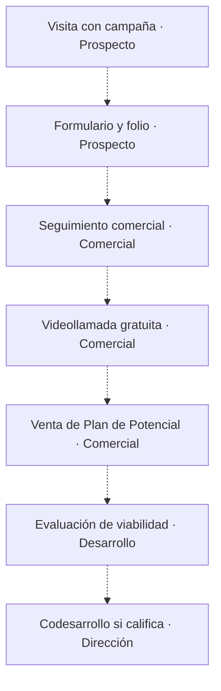

| Paso | Responsable | Componentes | Entrada → salida | Ejecución |
|---|---|---|---|---|
| 1. Visita con campaña | Prospecto | SYS-PLAN-POTENCIAL, SYS-MARKETING, SYS-POTENCIALES | Inicio del proceso → Visita con campaña | automatico |
| 2. Formulario y folio | Prospecto | SYS-PLAN-POTENCIAL, SYS-MARKETING, SYS-POTENCIALES | Visita con campaña → Formulario y folio | manual |
| 3. Seguimiento comercial | Comercial | SYS-PLAN-POTENCIAL, SYS-MARKETING, SYS-POTENCIALES | Formulario y folio → Seguimiento comercial | manual |
| 4. Videollamada gratuita | Comercial | SYS-PLAN-POTENCIAL, SYS-MARKETING, SYS-POTENCIALES | Seguimiento comercial → Videollamada gratuita | manual |
| 5. Venta de Plan de Potencial | Comercial | SYS-PLAN-POTENCIAL, SYS-MARKETING, SYS-POTENCIALES | Videollamada gratuita → Venta de Plan de Potencial | manual |
| 6. Evaluación de viabilidad | Desarrollo | SYS-PLAN-POTENCIAL, SYS-MARKETING, SYS-POTENCIALES | Venta de Plan de Potencial → Evaluación de viabilidad | manual |
| 7. Codesarrollo si califica | Dirección | SYS-PLAN-POTENCIAL, SYS-MARKETING, SYS-POTENCIALES | Evaluación de viabilidad → Codesarrollo si califica | manual |

Vacíos: Confirmación Calendar y seguimiento diario requieren verificación; No se comprobó enlace folio de lead a contrato y cobro.

Evidencia: [plan-potencial/CLAUDE.md](https://github.com/yodesarrollomx/plan-potencial/blob/78e616f858ad593f16891d2f5158cd46d5617bc2/CLAUDE.md#L79) — Secuencia comercial explícita.

## PROC-VENTA-CROKISS · Captación por herramienta gratuita

Estado: declarado.

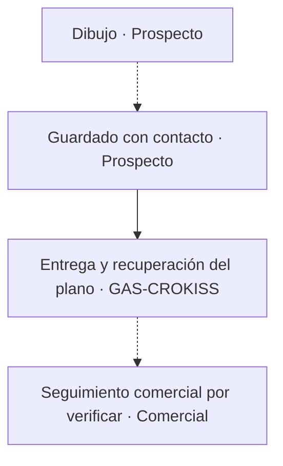

| Paso | Responsable | Componentes | Entrada → salida | Ejecución |
|---|---|---|---|---|
| 1. Dibujo | Prospecto | SYS-CROKISS | Inicio del proceso → Dibujo | manual |
| 2. Guardado con contacto | Prospecto | SYS-CROKISS | Dibujo → Guardado con contacto | manual |
| 3. Entrega y recuperación del plano | GAS-CROKISS | SYS-CROKISS | Guardado con contacto → Entrega y recuperación del plano | automatico |
| 4. Seguimiento comercial por verificar | Comercial | SYS-CROKISS | Entrega y recuperación del plano → Seguimiento comercial por verificar | pendiente |

Vacíos: No se comprobó integración de prospecto con CRM central ni tasa a venta.

Evidencia: [crokiss/CLAUDE.md](https://github.com/yodesarrollomx/crokiss/blob/3d440a21a6902fcefe79a124a804963613d5a31f/CLAUDE.md#L15) — Captación por guardado.

## PROC-INVERSION · Venta y aportaciones de codesarrolladores

Estado: codigo.

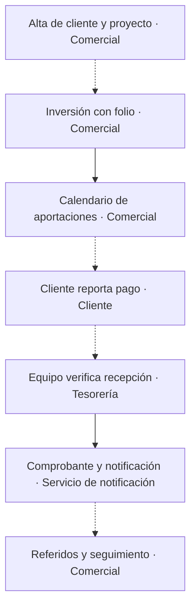

| Paso | Responsable | Componentes | Entrada → salida | Ejecución |
|---|---|---|---|---|
| 1. Alta de cliente y proyecto | Comercial | SYS-CODES-PORTAL, GAS-CODES | Inicio del proceso → Alta de cliente y proyecto | manual |
| 2. Inversión con folio | Comercial | SYS-CODES-PORTAL, GAS-CODES | Alta de cliente y proyecto → Inversión con folio | manual |
| 3. Calendario de aportaciones | Comercial | SYS-CODES-PORTAL, GAS-CODES | Inversión con folio → Calendario de aportaciones | automatico |
| 4. Cliente reporta pago | Cliente | SYS-CODES-PORTAL, GAS-CODES | Calendario de aportaciones → Cliente reporta pago | manual |
| 5. Equipo verifica recepción | Tesorería | SYS-CODES-PORTAL, GAS-CODES | Cliente reporta pago → Equipo verifica recepción | manual |
| 6. Comprobante y notificación | Servicio de notificación | SYS-CODES-PORTAL, GAS-CODES | Equipo verifica recepción → Comprobante y notificación | automatico |
| 7. Referidos y seguimiento | Comercial | SYS-CODES-PORTAL, GAS-CODES | Comprobante y notificación → Referidos y seguimiento | manual |

Vacíos: Conciliación con banco y Tesorería no comprobada; Alta de inversión y aportaciones usa secuencia de escrituras; atomicidad debe revisarse.

Evidencia: [Co-desarrolladores-Yod/src/App.jsx](https://github.com/yodesarrollomx/Co-desarrolladores-Yod/blob/f15154f784f204b60946985524e83a2539f40732/src/App.jsx#L2216) — Capital recibido calculado desde aportaciones.

## PROC-PROYECTO · Proyecto desde potencial hasta venta

Estado: codigo.

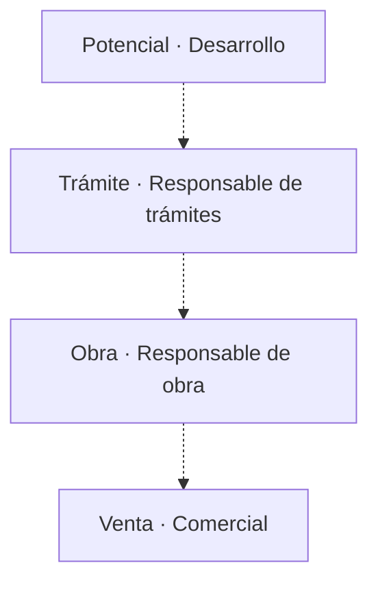

| Paso | Responsable | Componentes | Entrada → salida | Ejecución |
|---|---|---|---|---|
| 1. Potencial | Desarrollo | SYS-CONTROL, SYS-POTENCIALES, SYS-MIRAMAR, SYS-OBRA | Inicio del proceso → Potencial | manual |
| 2. Trámite | Responsable de trámites | SYS-CONTROL, SYS-POTENCIALES, SYS-MIRAMAR, SYS-OBRA | Potencial → Trámite | manual |
| 3. Obra | Responsable de obra | SYS-CONTROL, SYS-POTENCIALES, SYS-MIRAMAR, SYS-OBRA | Trámite → Obra | manual |
| 4. Venta | Comercial | SYS-CONTROL, SYS-POTENCIALES, SYS-MIRAMAR, SYS-OBRA | Obra → Venta | manual |

Vacíos: Etapas del registro son una fotografía mantenida manualmente; No se demostró relación persistida de folios entre todos los motores.

Evidencia: [yod-portal/os/proyectos.js](https://github.com/yodesarrollomx/yod-portal/blob/82f597bee316c942e4f631a507c7f8277178fcd3/os/proyectos.js#L36) — Etapas maestras de proyecto.

## PROC-OBRA · Avance y autorización de obra

Estado: codigo.

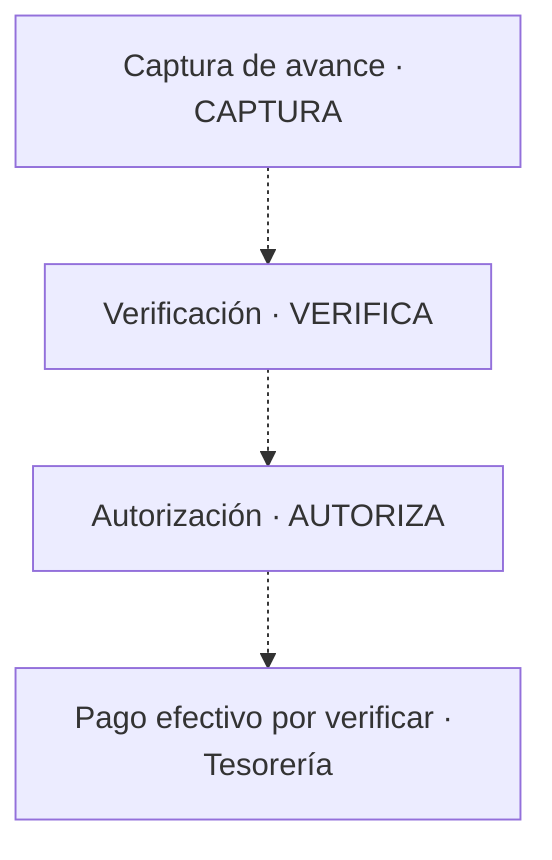

| Paso | Responsable | Componentes | Entrada → salida | Ejecución |
|---|---|---|---|---|
| 1. Captura de avance | CAPTURA | SYS-OBRA, GAS-OBRA | Inicio del proceso → Captura de avance | manual |
| 2. Verificación | VERIFICA | SYS-OBRA, GAS-OBRA | Captura de avance → Verificación | manual |
| 3. Autorización | AUTORIZA | SYS-OBRA, GAS-OBRA | Verificación → Autorización | manual |
| 4. Pago efectivo por verificar | Tesorería | SYS-OBRA, GAS-OBRA | Autorización → Pago efectivo por verificar | pendiente |

Vacíos: Autorización no equivale a movimiento de Tesorería; Existe captura por autorizador que queda autorizada directamente.

Evidencia: [yod-portal/obra.html](https://github.com/yodesarrollomx/yod-portal/blob/82f597bee316c942e4f631a507c7f8277178fcd3/obra.html#L387) — Cadena de firmas de obra.

## PROC-MARGEN · Control de margen por proyecto

Estado: propuesto.

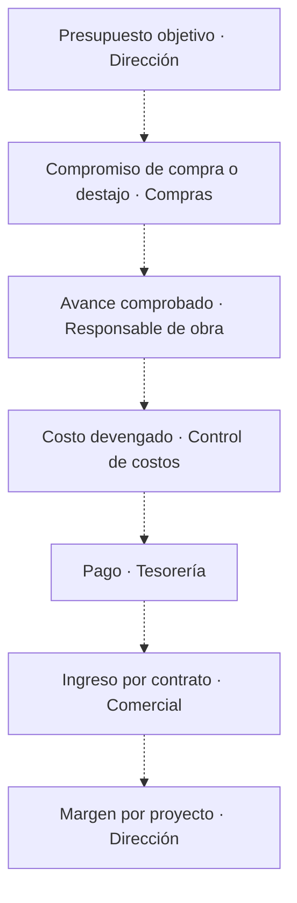

| Paso | Responsable | Componentes | Entrada → salida | Ejecución |
|---|---|---|---|---|
| 1. Presupuesto objetivo | Dirección | SYS-FLUJO, SYS-OBRA, SYS-INTERIORES, SYS-MIRAMAR | Inicio del proceso → Presupuesto objetivo | pendiente |
| 2. Compromiso de compra o destajo | Compras | SYS-FLUJO, SYS-OBRA, SYS-INTERIORES, SYS-MIRAMAR | Presupuesto objetivo → Compromiso de compra o destajo | pendiente |
| 3. Avance comprobado | Responsable de obra | SYS-FLUJO, SYS-OBRA, SYS-INTERIORES, SYS-MIRAMAR | Compromiso de compra o destajo → Avance comprobado | pendiente |
| 4. Costo devengado | Control de costos | SYS-FLUJO, SYS-OBRA, SYS-INTERIORES, SYS-MIRAMAR | Avance comprobado → Costo devengado | pendiente |
| 5. Pago | Tesorería | SYS-FLUJO, SYS-OBRA, SYS-INTERIORES, SYS-MIRAMAR | Costo devengado → Pago | pendiente |
| 6. Ingreso por contrato | Comercial | SYS-FLUJO, SYS-OBRA, SYS-INTERIORES, SYS-MIRAMAR | Pago → Ingreso por contrato | pendiente |
| 7. Margen por proyecto | Dirección | SYS-FLUJO, SYS-OBRA, SYS-INTERIORES, SYS-MIRAMAR | Ingreso por contrato → Margen por proyecto | pendiente |

Vacíos: Cadena objetivo propuesta; integración completa no demostrada; Interiores, obra, trámites y Tesorería necesitan claves y definiciones comunes.

Evidencia: [board-flujo-yod/CLAUDE.md](https://github.com/yodesarrollomx/board-flujo-yod/blob/ef2e6e1fade1b515d10af239bc60519417d906c4/CLAUDE.md#L44) — Limitación de granularidad descrita.

## PROC-DIRECCION · Aprobación y ejecución desde Despacho

Estado: declarado.

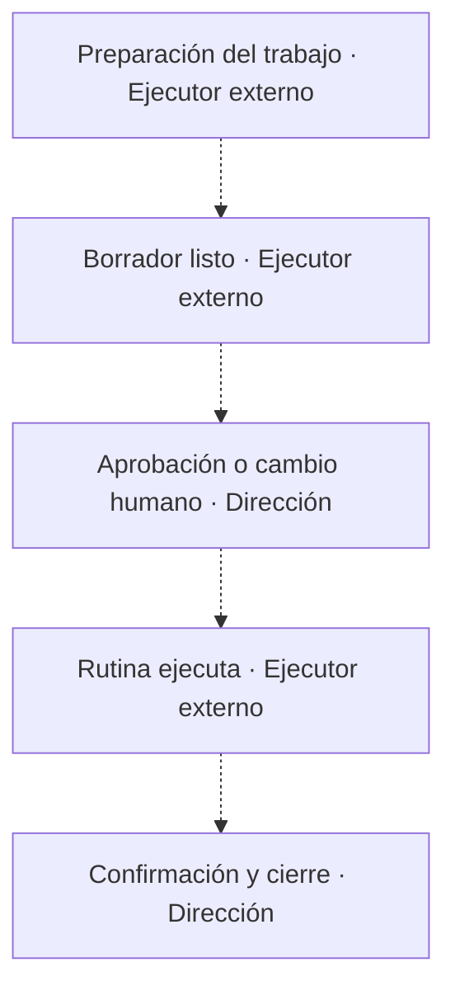

| Paso | Responsable | Componentes | Entrada → salida | Ejecución |
|---|---|---|---|---|
| 1. Preparación del trabajo | Ejecutor externo | SYS-DESPACHO, SYS-TAREAS, EXT-GMAIL | Inicio del proceso → Preparación del trabajo | pendiente |
| 2. Borrador listo | Ejecutor externo | SYS-DESPACHO, SYS-TAREAS, EXT-GMAIL | Preparación del trabajo → Borrador listo | pendiente |
| 3. Aprobación o cambio humano | Dirección | SYS-DESPACHO, SYS-TAREAS, EXT-GMAIL | Borrador listo → Aprobación o cambio humano | manual |
| 4. Rutina ejecuta | Ejecutor externo | SYS-DESPACHO, SYS-TAREAS, EXT-GMAIL | Aprobación o cambio humano → Rutina ejecuta | pendiente |
| 5. Confirmación y cierre | Dirección | SYS-DESPACHO, SYS-TAREAS, EXT-GMAIL | Rutina ejecuta → Confirmación y cierre | manual |

Vacíos: Rutina externa de correo no inspeccionada; Cierre debe distinguir enviado de resuelto con contraparte.

Evidencia: [yod-despacho/EJECUTOR.md](https://github.com/yodesarrollomx/yod-despacho/blob/5ad406a6b8584ee49466b15e03a9a3bf8a9ca4b9/EJECUTOR.md#L9) — Estados BANDEJA documentados.

## PROC-CONTENIDO · Producción de contenido con compuertas

Estado: codigo.

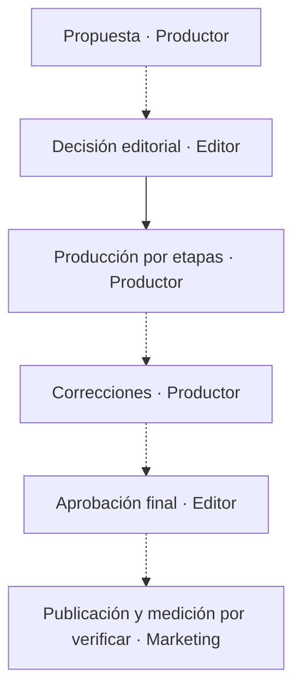

| Paso | Responsable | Componentes | Entrada → salida | Ejecución |
|---|---|---|---|---|
| 1. Propuesta | Productor | SYS-SALA, GAS-SALA, EXT-ACTIONS | Inicio del proceso → Propuesta | manual |
| 2. Decisión editorial | Editor | SYS-SALA, GAS-SALA, EXT-ACTIONS | Propuesta → Decisión editorial | manual |
| 3. Producción por etapas | Productor | SVC-SALA-PRODUCTOR, SVC-SALA-EJECUTOR, GAS-SALA, EXT-MOTORES-MEDIA, EXT-DRIVE | Decisión editorial → Producción por etapas | automatico |
| 4. Correcciones | Productor | SYS-SALA, GAS-SALA, EXT-ACTIONS | Producción por etapas → Correcciones | manual |
| 5. Aprobación final | Editor | SYS-SALA, GAS-SALA, EXT-ACTIONS | Correcciones → Aprobación final | manual |
| 6. Publicación y medición por verificar | Marketing | SYS-SALA, GAS-SALA, EXT-ACTIONS | Aprobación final → Publicación y medición por verificar | pendiente |

Vacíos: Atribución pieza a lead y venta no comprobada; Migración histórica a nube necesita reconciliación de dependencias; Atribución campaña/pieza a leads/citas sí existe en Marketing; cierre a venta/margen no comprobado; No se comprobaron reglas habilitadas, secrets, cuotas, cola ni ejecución viva; fuente presente no prueba producción.

Evidencia: [sala-edicion/CLAUDE.md](https://github.com/yodesarrollomx/sala-edicion/blob/dd62430eda613b73b703a3b9052214cbdd432ea7/CLAUDE.md#L29) — Compuerta de aprobación humana; [sala-edicion/nube/sala_cliente.py](https://github.com/yodesarrollomx/sala-edicion/blob/dd62430eda613b73b703a3b9052214cbdd432ea7/nube/sala_cliente.py#L42) — Decisiones humanas protegidas en cliente de nube; [sala-edicion/nube/sala_productor.py](https://github.com/yodesarrollomx/sala-edicion/blob/dd62430eda613b73b703a3b9052214cbdd432ea7/nube/sala_productor.py#L130) — Planificación en fuente versionada; [sala-edicion/nube/sala_ejecutor.py](https://github.com/yodesarrollomx/sala-edicion/blob/dd62430eda613b73b703a3b9052214cbdd432ea7/nube/sala_ejecutor.py#L48) — Etapas configurables.

## PROC-COBRO · Cobranza y caja

Estado: codigo.

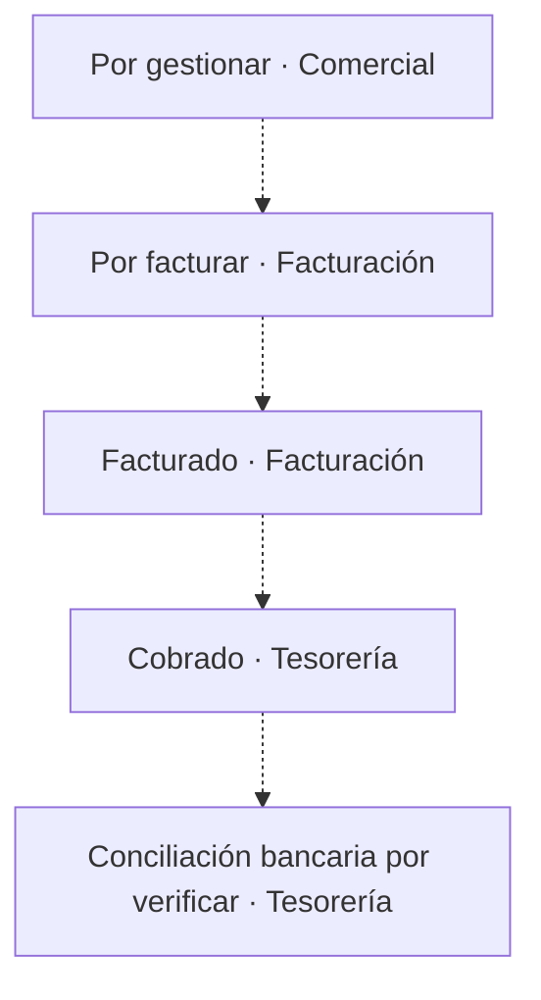

| Paso | Responsable | Componentes | Entrada → salida | Ejecución |
|---|---|---|---|---|
| 1. Por gestionar | Comercial | SYS-FLUJO | Inicio del proceso → Por gestionar | manual |
| 2. Por facturar | Facturación | SYS-FLUJO | Por gestionar → Por facturar | manual |
| 3. Facturado | Facturación | SYS-FLUJO | Por facturar → Facturado | manual |
| 4. Cobrado | Tesorería | SYS-FLUJO | Facturado → Cobrado | manual |
| 5. Conciliación bancaria por verificar | Tesorería | SYS-FLUJO | Cobrado → Conciliación bancaria por verificar | pendiente |

Vacíos: No se comprobó facturación integrada ni conciliación bancaria; Pago reportado o autorizado no debe confundirse con efectivo recibido.

Evidencia: [board-flujo-yod/index.html](https://github.com/yodesarrollomx/board-flujo-yod/blob/ef2e6e1fade1b515d10af239bc60519417d906c4/index.html#L324) — Estados existentes de ingresos esperados.

## PROC-INTERIORES · Selección y presupuesto de interiores

Estado: codigo.

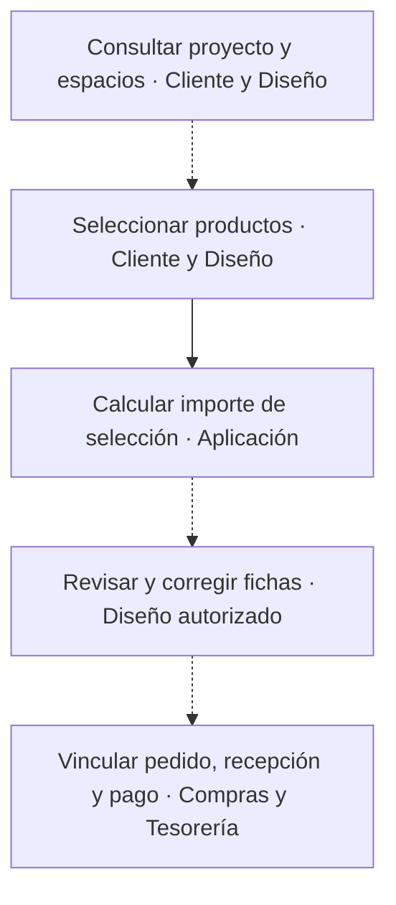

| Paso | Responsable | Componentes | Entrada → salida | Ejecución |
|---|---|---|---|---|
| 1. Consultar proyecto y espacios | Cliente y Diseño | SYS-INTERIORES | Proyecto autorizado → Catálogo de espacios y productos | manual |
| 2. Seleccionar productos | Cliente y Diseño | SYS-INTERIORES | Catálogo vigente → Selección por espacio | manual |
| 3. Calcular importe de selección | Aplicación | SYS-INTERIORES | Selección y precios → Importe de selección | automatico |
| 4. Revisar y corregir fichas | Diseño autorizado | SYS-INTERIORES | Cambios de catálogo → Ficha e historial de cambios | manual |
| 5. Vincular pedido, recepción y pago | Compras y Tesorería | SYS-INTERIORES | Selección aprobada → Compra y costo conciliado | pendiente |

Vacíos: No se comprobó conexión de selección con pedido, recepción o Tesorería; Aislamiento por proyecto y reglas de modificación deben comprobarse en backend vivo.

Evidencia: [interiores-aurum/llave-maestra.html](https://github.com/yodesarrollomx/interiores-aurum/blob/6722c50b504c2f326d29d187605b2ad126e7ce17/llave-maestra.html#L1413) — Presentación de selección; [interiores-aurum/llave-maestra.html](https://github.com/yodesarrollomx/interiores-aurum/blob/6722c50b504c2f326d29d187605b2ad126e7ce17/llave-maestra.html#L1056) — Métricas de espacios y presupuesto.

## PROC-TRAMITES · Trámites e hitos de desarrollo

Estado: codigo.

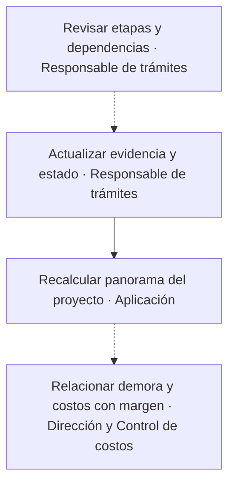

| Paso | Responsable | Componentes | Entrada → salida | Ejecución |
|---|---|---|---|---|
| 1. Revisar etapas y dependencias | Responsable de trámites | SYS-MIRAMAR, SYS-ALQUIMIA | Hitos y trámites del proyecto → Ruta de trabajo y bloqueos | manual |
| 2. Actualizar evidencia y estado | Responsable de trámites | SYS-MIRAMAR, SYS-ALQUIMIA | Entregable o resolución → Trámite actualizado | manual |
| 3. Recalcular panorama del proyecto | Aplicación | SYS-MIRAMAR, SYS-ALQUIMIA | Estado de trámites → Avance y cuellos visibles | automatico |
| 4. Relacionar demora y costos con margen | Dirección y Control de costos | SYS-MIRAMAR, SYS-ALQUIMIA | Ruta y costos → Efecto económico conciliado | pendiente |

Vacíos: Lectura agrupada de Alquimia no prueba propagación transaccional de cambios entre proyectos; No se comprobó conexión costo de demora a margen consolidado.

Evidencia: [alquimia-urbana/index.html](https://github.com/yodesarrollomx/alquimia-urbana/blob/bf295e2970ad008e58fa3f216a8cfc14353cf7e8/index.html#L418) — Gantt de trámites con dependencias.

## PROC-METAS · Metas, objetivos y ejecución semanal

Estado: codigo.

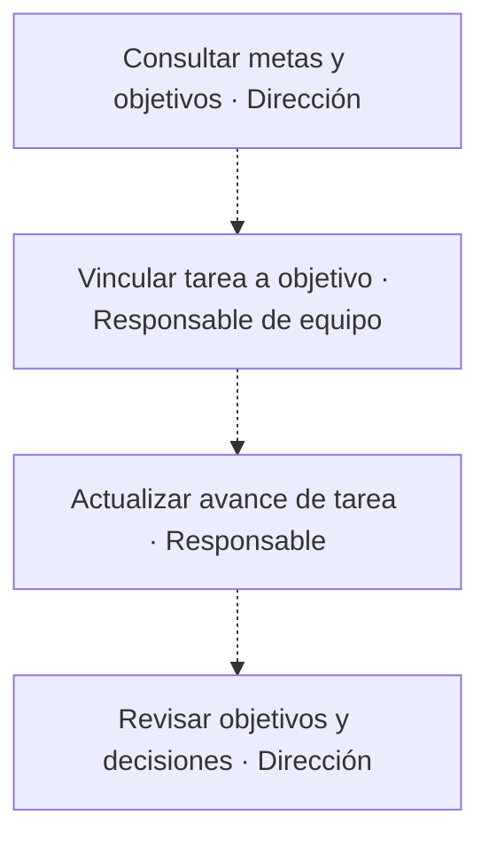

| Paso | Responsable | Componentes | Entrada → salida | Ejecución |
|---|---|---|---|---|
| 1. Consultar metas y objetivos | Dirección | SYS-TAREAS, GAS-MOAC-METAS, GAS-OPERACION | Libro de metas → Objetivos priorizados | manual |
| 2. Vincular tarea a objetivo | Responsable de equipo | SYS-TAREAS, GAS-MOAC-METAS, GAS-OPERACION | Tarea y objetivo → Relación tarea-objetivo | manual |
| 3. Actualizar avance de tarea | Responsable | SYS-TAREAS, GAS-MOAC-METAS, GAS-OPERACION | Trabajo y evidencia → Estado de tarea | manual |
| 4. Revisar objetivos y decisiones | Dirección | SYS-TAREAS, GAS-MOAC-METAS, GAS-OPERACION | Tareas y objetivos → Decisión semanal | manual |

Vacíos: Hay dos motores distintos; comprobar consistencia e IDs al mover, archivar o eliminar tareas; No se comprobó que el cierre de tarea dispare automáticamente cierre de objetivo.

Evidencia: [board-aurum/src/App.jsx](https://github.com/yodesarrollomx/board-aurum/blob/096550e5647a63048450b9be848be71901a32a3a/src/App.jsx#L854) — Vinculación de tarea a objetivo; [board-aurum/src/App.jsx](https://github.com/yodesarrollomx/board-aurum/blob/096550e5647a63048450b9be848be71901a32a3a/src/App.jsx#L858) — Cambio explícito de estado del objetivo.

## PROC-EMD-PROFILES · Perfil fotográfico privado de evaluación

Estado: propuesto.

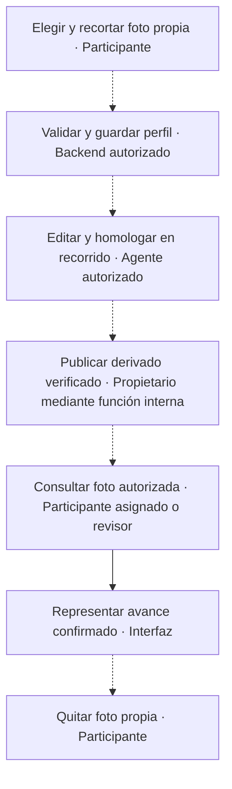

| Paso | Responsable | Componentes | Entrada → salida | Ejecución |
|---|---|---|---|---|
| 1. Elegir y recortar foto propia | Participante | SYS-EMD | Imagen local elegida por la persona → Recorte sRGB convertido localmente a JPEG baseline sin metadatos personales; alineación progresiva y ajuste manual disponibles | manual |
| 2. Validar y guardar perfil | Backend autorizado | GAS-EMD, SHEET-EMD, EXT-DRIVE | Imagen validable, revisión e identificador de mutación → Original privado confirmado, visible solo en Mi foto, pendiente de homologación | pendiente |
| 3. Editar y homologar en recorrido | Agente autorizado | GAS-EMD, SHEET-EMD, EXT-DRIVE | Original privado y metadata de revisión capturada → Derivado editado uniforme, original conservado y evidencia privada | pendiente |
| 4. Publicar derivado verificado | Propietario mediante función interna | GAS-EMD, SHEET-EMD, EXT-DRIVE | JPEG o PNG transparente estricto privado de 512 × 512 e identidad/revisión/hash/archivo fuente esperados → Derivado publicado solo si fuente sigue vigente; conflicto conserva upload posterior | pendiente |
| 5. Consultar foto autorizada | Participante asignado o revisor | SYS-EMD, GAS-EMD, EXT-DRIVE | Sesión y relación autorizadas → Derivado homologado vigente autorizado o silueta; nunca original pendiente | pendiente |
| 6. Representar avance confirmado | Interfaz | SYS-EMD | Perfil autorizado o silueta y estado confirmado ya disponible → Tarjeta en tres columnas con nombre completo, cargo verificado opcional y retrato mayor; borde gris/naranja/verde y estado accesible sin etiquetas visibles | automatico |
| 7. Quitar foto propia | Participante | SYS-EMD, GAS-EMD, SHEET-EMD, EXT-DRIVE | Revisión vigente y mutación propia → Perfil sin foto confirmado, con reintento seguro | manual |

Vacíos: Selección y recorte requieren decisión de la persona; La apariencia por estado no sustituye el texto, el foco ni el estado confirmado del servidor; el atlas no contiene fotos ni metadatos personales; Habilitar y verificar servicio avanzado Drive v3/API; si falta, el recorrido rechaza operación sin alternativa permisiva; Circuito privado del agente y tratamiento uniforme están propuestos; no publicados por documentarlos; No usar una foto real como fixture ni copiar originales/derivados o metadata privada al atlas público.

Evidencia: Proceso propuesto; no acredita operación publicada.

## PROC-EMD-DRAFTS · Recuperación revisada de borrador local

Estado: propuesto.

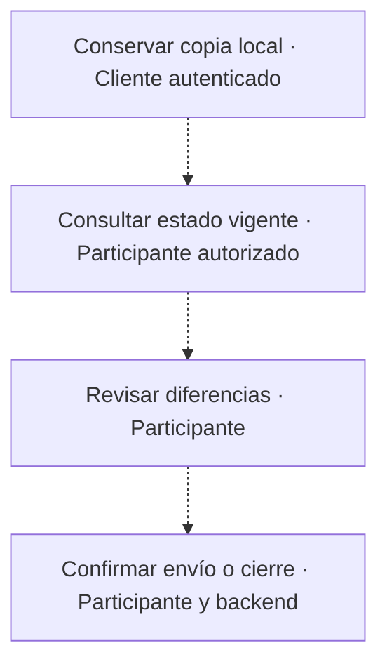

| Paso | Responsable | Componentes | Entrada → salida | Ejecución |
|---|---|---|---|---|
| 1. Conservar copia local | Cliente autenticado | SYS-EMD, STORE-EMD-DRAFTS | Snapshot de edición o mutación pendiente → Copia cifrada durable o aviso explícito de indisponibilidad | pendiente |
| 2. Consultar estado vigente | Participante autorizado | SYS-EMD, GAS-EMD | Sesión vigente y asignación propia → Revisión y cierre confirmados por servidor | pendiente |
| 3. Revisar diferencias | Participante | SYS-EMD, STORE-EMD-DRAFTS | Copia local descifrada y versión del servidor → Decisión explícita de recuperación, modificación o descarte | manual |
| 4. Confirmar envío o cierre | Participante y backend | SYS-EMD, GAS-EMD, SHEET-EMD | Mutación exacta revisada o nueva modificación autorizada; cierre con consentimiento nuevo → Confirmación real o conflicto sin sobrescritura automática | manual |

Vacíos: Revisión y decisión de recuperar requieren consentimiento; no hay recuperación ni cierre automáticos; Persistencia limitada al navegador y enlace; no garantiza recuperación tras borrar almacenamiento; Pruebas táctiles y escritorio sintéticos no certifican Safari ni un teléfono físico.

Evidencia: Proceso propuesto; sin datos humanos ni publicación acreditada.

## PROC-EMD-CONTACTS · Preparación privada de contactos y recordatorios

Estado: propuesto.

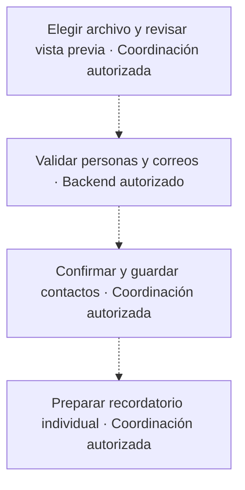

| Paso | Responsable | Componentes | Entrada → salida | Ejecución |
|---|---|---|---|---|
| 1. Elegir archivo y revisar vista previa | Coordinación autorizada | SYS-EMD | CSV, TSV o XLSX local de hasta 250 filas → Vista previa sin escritura | manual |
| 2. Validar personas y correos | Backend autorizado | GAS-EMD, SHEET-EMD | Identificador exacto o nombre único y correo → Coincidencias activas o errores por fila | pendiente |
| 3. Confirmar y guardar contactos | Coordinación autorizada | SYS-EMD, GAS-EMD, SHEET-EMD | Filas revisadas, revisión esperada e identificador de mutación → Contactos confirmados o conflicto sin sobrescritura | manual |
| 4. Preparar recordatorio individual | Coordinación autorizada | SYS-EMD | Persona pendiente y correo confirmado → Asunto y texto copiable sin envío ni enlace personal | manual |

Vacíos: El envío real requiere destinatarios verificados y autorización específica; no forma parte de esta propuesta; La vista previa y las pruebas sintéticas no sustituyen revisión humana de nombres y correos; No emitir ni reemitir accesos y no reiniciar evaluaciones al preparar un recordatorio.

Evidencia: Proceso propuesto; detalle operativo y datos personales permanecen en el sistema privado.
