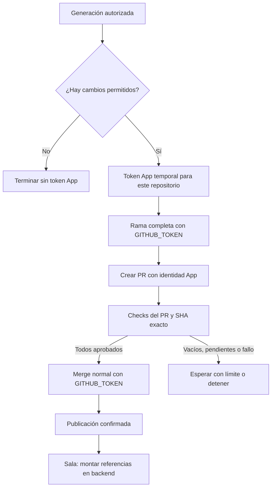

# Identidad del publicador automático

Propuesta `CHG-PUBLICADORES-APP-001`, contrato `CTR-PUBLICADOR-GITHUB`.
Estado: diseño y pruebas aisladas; registro, instalación y comprobación operativa pendientes.

Sala de Edición y Marketing preparan cambios en una rama, crean un PR, esperan sus revisiones obligatorias y solicitan el merge normal. Sala publica los recursos antes de montar sus referencias en Apps Script. Cada fase exige el commit previsto y un resultado comprobado.

Las ejecuciones observadas fallaron después de crear PR con `GITHUB_TOKEN`: sus workflows requieren aprobación, mientras la corrida manual aprobada no satisface el check del PR. Sala es un repositorio público con protección; este fallo no proviene de una limitación de su plan. La política y la alternativa de identidad propia están documentadas por [GitHub](https://docs.github.com/en/actions/concepts/security/github_token).

## Flujo propuesto

La App privada pertenece a `yodesarrollomx` y se instala **solo en `sala-edicion` y `aurum-board`**. Permisos: `contents: read` y `pull_requests: write`, además de metadatos de lectura implícitos. Sin permisos de Actions, administración o checks; sin webhooks ni autorización OAuth del usuario. El token App se usa únicamente al crear el PR. No omitir revisiones ni generar checks que sustituyan al workflow requerido.

## Registro y configuración

1. Ejecutar `python3 scripts/registrar-publicador.py --output-dir /ruta/privada/nueva/fuera-de-git`. El padre debe existir. El servidor escucha únicamente en `127.0.0.1`, presenta el manifiesto y caduca a los 30 minutos.
2. La persona propietaria abre el enlace local, revisa el formulario y confirma la creación en GitHub. El retorno valida un estado aleatorio de un solo uso. La llave y los metadatos se guardan con permisos `0600` en un directorio `0700`; nunca se imprimen ni se guardan en el repositorio.
3. Seguir el enlace de instalación y elegir **Only select repositories**, exclusivamente los dos repositorios indicados. La creación y la instalación requieren consentimiento personal de GitHub; el script no realiza estos pasos por API. El [protocolo oficial de manifiestos](https://docs.github.com/en/apps/sharing-github-apps/registering-a-github-app-from-a-manifest) describe este intercambio.
4. Verificar propietario, permisos e instalación exacta con la API antes de configurar. En cada repositorio, guardar el ID como variable `YOD_PUBLISHER_APP_ID` y la llave como secreto `YOD_PUBLISHER_APP_PRIVATE_KEY`, usando entrada estándar de `gh secret set`; no copiarla al chat ni pasarla como argumento. No reutilizar la credencial personal de `gh`.
5. Integrar los PR con sus checks aprobados y observar una publicación autorizada sin efectos financieros de prueba. Registrar por separado creación de PR, checks, merge y publicación. No declarar producción verificada por las pruebas con dobles.

Si el retorno falla, verificar primero si la App ya existe; el código de conversión es de un solo uso y no se reintenta a ciegas. Si falta una llave por un fallo parcial, recuperarla o rotarla desde la configuración de esa App. No crear aplicaciones duplicadas.

## Reversión

Revertir los cambios por PR, eliminar los dos secretos/variables y revocar la instalación o la llave de esta App. Conservar recursos generados y registros operativos; un fallo de publicación nunca autoriza borrar datos ni montar recursos todavía no publicados.

## Comprobación aislada

`node --test tests/registrar-publicador.test.cjs` ejecuta pruebas sin red de conversión: alcance del manifiesto, estado inválido/duplicado, caducidad, repetición, permisos inesperados, ubicación privada, permisos de archivo y errores HTTP sin secretos. Los repositorios consumidores comprueban además separación de tokens, cambios permitidos, ausencia de cambios, checks incompletos, SHA y orden de publicación.
