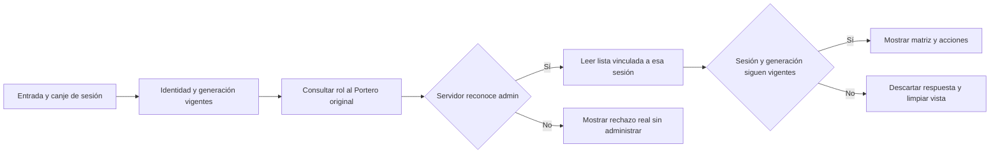

# Sala172 · Administración vinculada a la sesión actual

La pantalla de Accesos puede conservar un rol anterior o aplicar una respuesta que corresponde a otra sesión. También restaura un destino de respaldo que no coincide con la política del Portero compartido. Diagnóstico y reproducción aislados; falta acreditar la sesión administradora real.

## Propuesta autorizada

- Consultar el rol al servidor; la caché local no decide la administración.
- Esperar el procesamiento de la entrada y asociar canje/listado al token y generación vigentes. Descartar respuestas anteriores; limpiar datos y deshabilitar acciones al cambiar sesión.
- Usar el Portero original por solicitud, conservando rechazos explícitos. No restaurar ni persistir un respaldo local; no reintentar escrituras automáticamente.
- Conservar la matriz, el código DP ya existente, los códigos adicionales y los campos de los upserts. No elevar roles ni modificar backend, usuarios o hojas.

## Evidencia y reversión

Regresiones con datos sintéticos: caché de rol, prefijos de token, canje/listado tardíos, entrada/cambio/cierre de sesión y respaldo persistido; conservación de DP y upserts. Verificación real de administración antes de cerrar Sala172. Revertir frontend/pin mediante PR sin borrar registros ni alterar el escritor o los permisos del backend.
