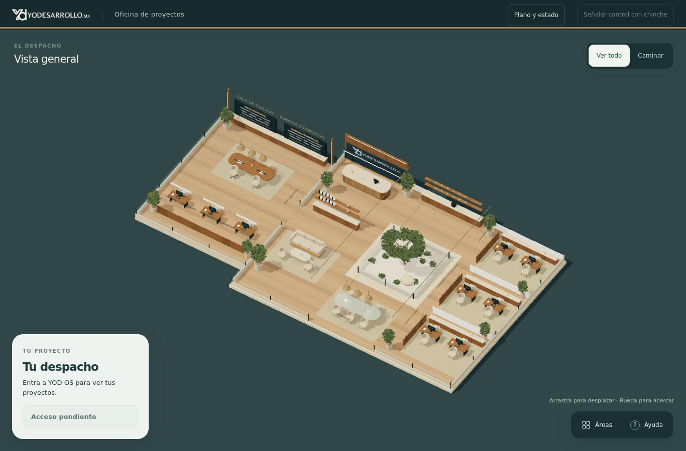
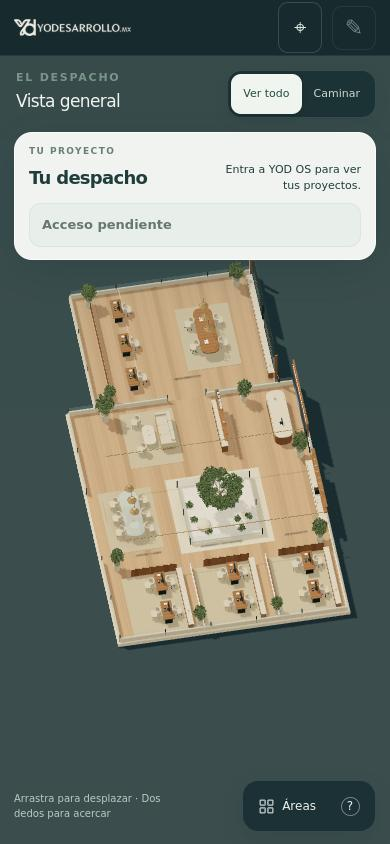

# Entrada pública del despacho · 7 octubre 2026

Capturas reales de la página publicada, conservadas el 2026-10-07 06:53:27 UTC.
Versión del portal: `264d2cdee87fb7a2c0a40b81d065f32bc0643bb0`.

Origen: [ejecución 37582745228](https://github.com/yodesarrollomx/yod-portal/actions/runs/37582745228), job `112665917741`, artefacto `11465656607`.
Se extrajeron sin edición de los marcadores JPEG `PUBLISHED_ENTRY_1366` y `PUBLISHED_ENTRY_390` del registro de la prueba.

- Escritorio: 1366 px, 2026-10-07 06:45:18 UTC.
- Móvil: 390 px, 2026-10-07 06:45:28 UTC.
- Navegación real a GitHub Pages, sin respuestas interceptadas ni sesión privada.
- Versiones comprobadas: `live-voice-boot.mjs?v=18` y `agents.js?v=10`.

Estas imágenes acreditan la entrada pública de esta entrega. El estado «Acceso pendiente» es esperado sin sesión. No acreditan micrófono, agentes privados, escritura de negocio, aceptación estética ni la conclusión de los tres pasos. La integración workspace/PPP se comprobó por separado con servicios sintéticos.

Esta rama sólo conserva evidencia documental. No modifica el despliegue de main.

